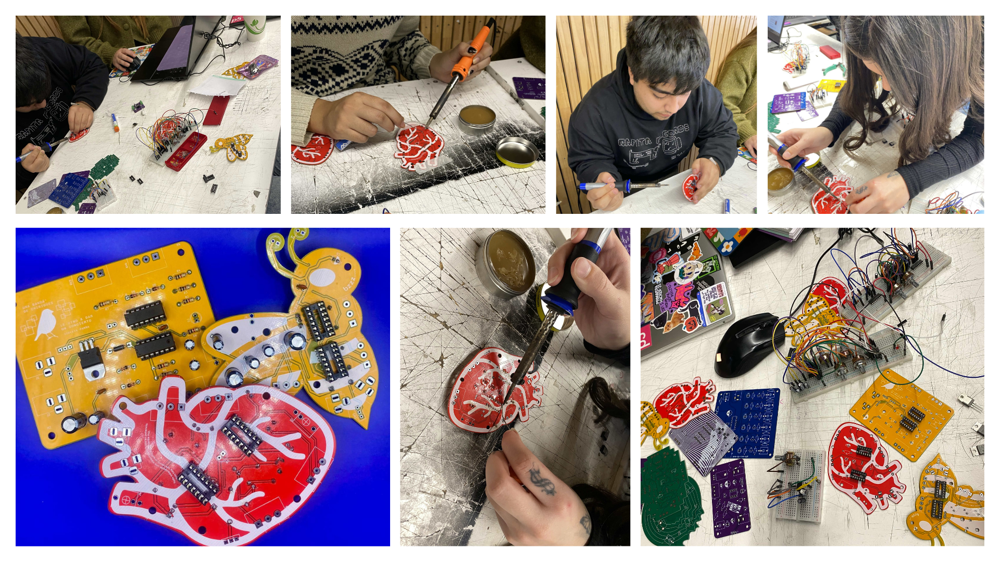
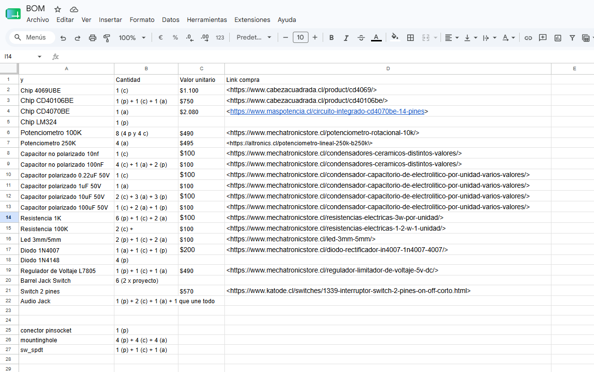
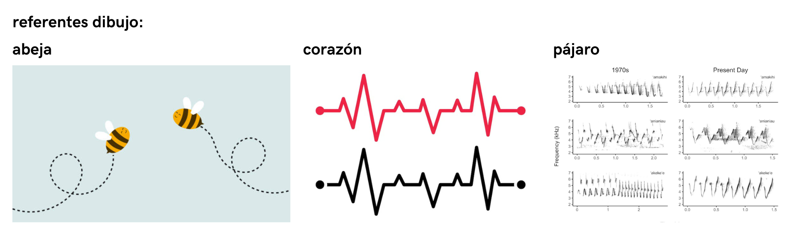
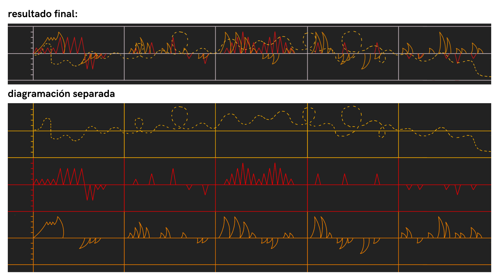

# sesion-14a

Martes 16 de Junio, 2026.

Nota del día: es divertido soldar (a pesar de que no lo hice yo).

## Qué pasó hoy

### Soldadura 

El día de ayer llegaron las placas así que hoy comenzamos full con el proceso de soldar todos los componentes a las placas. 

Traje pasta de soldar, dos tipos de estaños/soldadura y un cautín. 

La martina y la carla no sabían mucho sobre soldar así que los chiquillos (la vania y el nico) se dividieron cada uno en una placa (misaa nos prestó otro cautín) y con cada una de las chiquillas comenzaron a hacer una placa. La martina y el nico hicieron la abeja y la carla y la vania hicieron el corazón. 

ALgunos problemas:

- Para la placa de la abeja se conectó un diodo con las polaridades invertidas.
- Para la placa del corazón se soldaron los chips por el lado contrario y eso hizo que los pines estuvieron invertados, para no desconectar/desoldar todos esos pines prefirieron comenzar en otra placa.

### Desarrollo BOM

Ya que no teníamos más soldadura y no se podía avanzar en paralelo en las tres placas decidí comenzar a realizar el BOM más en detalle y dejarlo listo. Para poder organizarme mejor lo desarrolle en un excel para después poder convertirlo en tabla de markdown por medio de esta página: <https://www.tablesgenerator.com/markdown_tables>

  El desarollo logrado en clase fue este:

## Qué pasó en la semana 

### Partituras

Si bien ya teníamos ideas bases de como queríamos que fuera el desarrollo de cada idea de partitura no habíamos comenzado con el desarrollo total de cada una. La vania hizo el de la partitura 1 con la base desarrollada por ella, la carla y el nico. La carla desarrolló la partitura 2 con la base hecha por mí. 

#### Partitura 1

"Esta no tiene pentagramas, no tiene corcheas, no tiene nada que te haga sentir mal por no saber solfeo. Es una partitura para tres criaturas electrónicas que nunca han tomado clases de música y están muy bien así. El sintetizador se toca en tiempo real, ajustando las perillas de cada módulo según las instrucciones de cada acto."

Funciona por medio de 4 actos que signfican algo respecto a cada sonido independiente, para saber como tocar se muestran de ejemplos las siguientes tablas: (es una por cada acto, la siguiente es solo del acto 1)

| Módulo | Perilla 1 | Perilla 2 | Perilla 3 |
|--------|-----------|-----------|-----------|
| Chirihue Mecanizado | 240° | 220° | 60° |
| Berry Benson | 220° | 240° | 60° |
| Lupdup | 240° | 220° | 200° |

#### Notas de interpretación

- Todas las perillas parten en 0°, es decir, giradas completamente hacia la izquierda. Los grados indicados en la tabla se cuentan desde ese punto girando en sentido horario. Por ejemplo, 180° es exactamente la mitad del recorrido de la perilla. 
- Las perillas no mencionadas en la tabla se dejan fijas en la posición que suene mejor al momento de armar el instrumento. No se tocan durante la interpretación.
- Las transiciones entre actos no son abruptas. Las perillas se giran despacio, como quien no quiere que nadie se dé cuenta de que algo cambió.
- Los grados son un punto de partida, no una ley. Si al girar una perilla suena horrible, gírala hasta que suene bien y anótalo. La partitura es un ser vivo.
- Si en algún momento los tres módulos suenan al mismo tiempo en su punto más alto, eso no es un error. Eso es el clímax. Felicitaciones.
- El silencio de 20:01 a 07:59 no es silencio total: Lupdup sigue latiendo. Siempre sigue latiendo.

#### Partitura 2 

Para desarrollar mejor la idea de partitura 2 se buscaron referentes de dibujo. 

En base a eso se decidió lo siguiente: 

- Para las abejas, color amarillo (🟡), se hicieron las líneas que se usan para ilustrarlas de manera caricaturesca.
- El corazón, color rojo (🔴) es utiliza las lineas de signos vitales que se pueden ver en una máquina de signos vitales.
- Para el pájaro, color naranjo (🟠), se hizo una variación de un espectrograma que captaba el sonido de las aves. (*Los espectrogramas son un gráfico visual que muestran los sonidos o señales acústicas registradas.*).

El resultado es el siguiente: 

### BOM finalizado

El mismo martes pero en la noche pude terminar el BOM, y quedó así: 

| Componente                      | Cantidad  | Valor unitario  | Link compra                                                                                           |
|---------------------------------|-----------|-----------------|-------------------------------------------------------------------------------------------------------|
| Placa Barry Benson              | 1         | -               | -                                                                                                     |
| Placa Lub-dub                   | 1         | -               | -                                                                                                     |
| Placa Chirihue Mecanizado       | 1         | -               | -                                                                                                     |
| Chip 4069UBE                    | 1         | $1.100          | <https://www.cabezacuadrada.cl/product/cd4069/>                                                       |
| Chip CD40106BE                  | 3         | $750            | <https://www.cabezacuadrada.cl/product/cd40106be/>                                                    |
| Chip CD4070BE                   | 1         | $2.080          | <https://www.maspotencia.cl/circuito-integrado-cd4070be-14-pines>                                     |
| Chip LM324                      | 1         | $590            | <https://www.mechatronicstore.cl/amplificador-operacional-lm324/>                                     |
| Potenciometro 100K              | 8         | $490            | <https://www.mechatronicstore.cl/potenciometro-rotacional-10k/>                                       |
| Potenciometro 250K              | 4         | $495            | <https://altronics.cl/potenciometro-lineal-250k-b250k\>                                               |
| Capacitor no polarizado 10nf    | 1         | $100            | <https://www.mechatronicstore.cl/condensadores-ceramicos-distintos-valores/>                          |
| Capacitor no polarizado 100nF   | 7         | $100            | <https://www.mechatronicstore.cl/condensadores-ceramicos-distintos-valores/>                          |
| Capacitor polarizado 0.22uF 50V | 1         | $100            | <https://www.mechatronicstore.cl/condensador-capacitorio-de-electrolitico-por-unidad-varios-valores/> |
| Capacitor polarizado 1uF 50V    | 1         | $100            | <https://www.mechatronicstore.cl/condensador-capacitorio-de-electrolitico-por-unidad-varios-valores/> |
| Capacitor polarizado 10uF 50V   | 8         | $100            | <https://www.mechatronicstore.cl/condensador-capacitorio-de-electrolitico-por-unidad-varios-valores/> |
| Capacitor polarizado 100uF 50V  | 4         | $100            | <https://www.mechatronicstore.cl/condensador-capacitorio-de-electrolitico-por-unidad-varios-valores/> |
| Resistencia 1K                  | 9         | $100            | <https://www.mechatronicstore.cl/resistencias-electricas-3w-por-unidad/>                              |
| Resistencia 100K                | 2         | $100            | <https://www.mechatronicstore.cl/resistencias-electricas-1-2-w-1-unidad/>                             |
| Led 3mm/5mm                     | 5         | $100            | <https://www.mechatronicstore.cl/led-3mm-5mm/>                                                        |
| Diodo 1N4007                    | 3         | $200            | <https://www.mechatronicstore.cl/diodo-rectificador-in4007-1n4007-4007/>                              |
| Diodo 1N4148                    | 4         | $120            | <https://www.cabezacuadrada.cl/product/diodo-1n4148/>                                                 |
| Regulador de Voltaje L7805      | 3         | $490            | <https://www.mechatronicstore.cl/regulador-limitador-de-voltaje-5v-dc/>                               |
| Barrel Jack Switch              | 6         | -               | -                                                                                                     |
| Audio Jack                      | 5         | -               | -                                                                                                     |
| Conector Pinsocket  (placa)     | 6         | $400            | <https://www.ebay.com/itm/125539599767>                                                               |
| Pernos 3mm (para mountinghole)  | 13        | $39,9           | <https://www.mercadolibre.cl/pack-x100u-perno-allen-m3-negro-cabeza-boton-8mm/>                       |
| Switch encendido/apagado        | 3         | -               | -                                                                                                     |

En resumen, usamos: 

- 3 placas distintas, 1 unidad de cada una
- 4 tipos de chips, siendo la unidad mas usada el 40106 
- 2 tipos de potenciometros
- 2 tipos de capacitores no polarizados 
- 4 tipos de capacitores polarizados 
- 2 tipos de resistencias
- 2 tipos de diodos 

(+) leds, reguladores de voltaje, audio jack, jack switch, entre otros componentes. 

Respecto al stock tenemos todos los componentes necesarios. 

Ya que los chiquillos hicieron gran parte del trabajo yo realicé el github para la presentación del día viernes. 

## Encargo-14a

Leer capítulo 5 y 6 del libro Pomelo de Yoko Ono, compartir apuntes y reflexiones críticas sobre el texto, prohibido usar inteligencia artificial, no sirve para este ejercicio.

### Capítulo 5: Objeto

Mis favoritos: 

- Pieza de Venus de Milo. (Entregar pequeños trozos a la gente que / acuda a verla. / Pedirles que los lustren en casa. / Pedirles que los devuelvan dentro de cincuenta años / para volver a armar la Venus.) 
- Pieza de colección I. (Elegir un tema. / Escribir cinco millones de páginas (a un espacio) / sobre él.)
- Pieza de chimenea. (Construir tres mil chimeneas y alinearlas / para que desde cierto lugar parezcan / una, y tres mil desde otro.)
- Pieza telescópica. (Hacer una escultura para poner en una montaña / y que la gente la mire con telescopios.)

### Capítulo 6: Cine

Mis favoritos: 

- Film total. (1. Dar a varios directores una copia del mismo film. / 2. Pedir a cada uno que lo copie igual, sin descartar / nada del material de modo que no se note que la copia /fue copiada. / 3. Exhibir todas las versiones juntas, una tras otra, / como un film total.)

### Apuntes generales 

- Fueron capítulos muuuuuuy cortos comparados con los otros, aunque las piezas de cine fueron más largas.
- Aunque el capítulo de Objeto es breve, muchas de sus piezas involucran escalas temporales enormes (décadas, millones de páginas, miles de objetos).
- En ambos capítulos se habla un poco de la idea de colaboración. Muchas obras no pueden ser realizadas por una sola persona y requieren comunidades enteras o largos períodos de tiempo.
- Sobre la pieza telescópica me hizo pensar que tal vez la escultura podría tener una relación con fenómenos astronómicos. Por ejemplo, que en ciertos momentos del año el Sol o la Luna se alinearan con alguna abertura o forma de la estructura. Eso haría que observarla con un telescopio tuviera más sentido que simplemente verla con binoculares, porque el instrumento pasaría a formar parte de la experiencia artística.
- A diferencia de los otros capítulos aquí si importa el resultado (más que el desarrollo).
- Muchas de las piezas parecen imposibles de realizar, pero justamente por eso obligan a imaginar cómo serían si existieran.
- En estos capitulos parece que Yoko Ono se pregunta o reflexiona qué hace que un objeto o una obra sigan siendo los mismos a través de los años (o por su parte como estos cambian).
- Sobre la obra de Venus me gusta la idea de que miles de personas cuiden pequeños fragmentos durante cincuenta años para luego reconstruirla. Hace pensar que las obras de arte pertenecen a la comunidad y no solo a los museos.
- ¿Será realmente posible replicar algo tantas veces que cada nueva versión intente ser (o sea) idéntica a la anterior? Me parece una reflexión muy adelantada a su época, especialmente considerando que hoy vivimos rodeados de reproducciones digitales, remixes, versiones, capturas de pantalla y contenido replicado constantemente (especialmente con la ia que intenta copiar o asemejarse a ciertos tipos de arte). 
