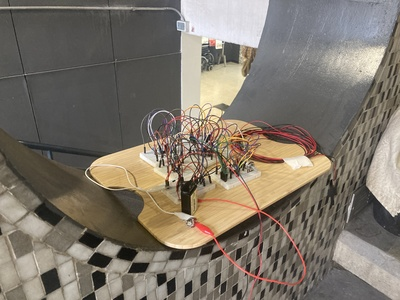
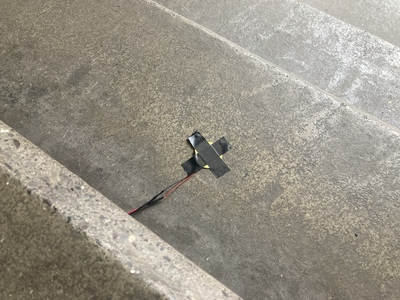
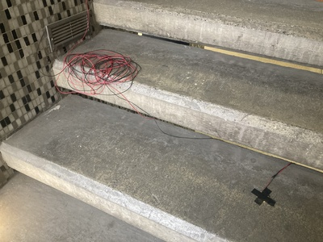

# sesion-13a

- preparación para examen!!!
  - vimos las placas
    - encuentro impactante que estamos en un momento en el que puedo hacer unos dibujitos en mi computador y que cuando se manda eso a **china** me llega una placa PCB funcional *(*ojalá*)* en menos de 1 mes....
      - realmente loco
  
- por problema nuestro al mandar el archivo pusimos la serigrafía en la capa de User y no F.Silkscreen por lo que no se mandó con el dibujo planeado
  - para arreglar esto pensamos que para la carcasa podemos tener la PCB suspendida con spacers y sobre la PCB tener una plancha de vinilo semi-transparente lechoso/blanco/opalina al que le grabamos el dibujo
    - además eso nos permite instalar los potenciómetros en la plancha de vinilo

- ## partitura!!
- ### **idea 1**
  - usando el libro de Yoko Ono *(o si?)* como referencia comenzamos con la primera idea de partitura
    - estuvimos pensando en nuestro piezo y nos dimos cuenta que funciona con las vibraciónes (wow) y que eso nos recordaba a la escalera del terror en Republica 180
      - la escalera de la entrada tiembla al caminar y siempre nos da miedo que se rompa un escalón al caminar por ahí
    - llegamos a algo así:
      - (ver literal) Como grupo 01 (las 5 personas) nos vamos a Republica 180, Santiago de Chile con "maincra" (piezo 01), el parlante estandar y un oscilador. Al llegar a la FAAD situamos "maincra" en uno de los hoyos de la muralla que soporta la escalera de cemento expuesto. Conectamos los piezos a escalones en distintos pisos y nos unimos a los estudiantes/profesores/funcionarios que estén subiendo o bajando la escalera. La idea es hacer sonar el oscilador a traves de nuestro circuito (y el parlante). Esto duraría 5 minutos.
        - *Para poder mostrar esto a la comisión tenemos pensado 2 ideas. La primera sería transmitirlo por Discord, pero lo ideal sería que nos acompañen para que lo puedan ver y escuchar de mejor manera.*
      - (ver partitura) Dirígete a Republica 180, Santiago de Chile. Conecta los piezos a los escalones de cemento en la entrada. Unete al baile de los estudiantes y escucha tus pasos.

 *(me doy cuenta ahora que [Jasper Marsalis](https://emalin.co.uk/artists/jasper-marsalis?l=artists/jasper-marsalis/MARSJ-2022014) nos ganó y ya hizo algo por el estilo)* 

  - ### **idea 2**
    - me gustaría que una fuera así:
      - uno se pone el piezo en el cuello y sale de la sala (ya que el cable es largo) caminando mientras grita/gruñe (esto ya que el piezo si se activa con esas vibraciónes). en un momento el cable no dá más y se va a caer del cuello.
        - me imagino el cable tensandose más y más mientras uno se aleja hasta que de la nada se cae y pierde la tensión a la vez que el synth deja de producir sonido
       
-------------------------

  - ### musica hola
    - recomendación de 2 canciónes:
      - https://juliancasablancasthevoidz.bandcamp.com/track/human-sadness
        - la mejor canción de Julian Casablancas (objetívo y confirmado)
          - me gusta mucho el uso del sidechain *(?)* en la canción que hacen con el bajo
            - es un elemento principal que da mucho carácter y ñeque

      - https://music.youtube.com/watch?v=07VRRfD6vrw&si=3QTqJbmfmoqTXi7E
        - AKRIILA y "Jane Remover"
          - 2 artistas jovenes que son demasiado pro
            - un collab que no me esperaba pero funciona 100%
              - y primera vez que "Jane Remover" canta en español
      
