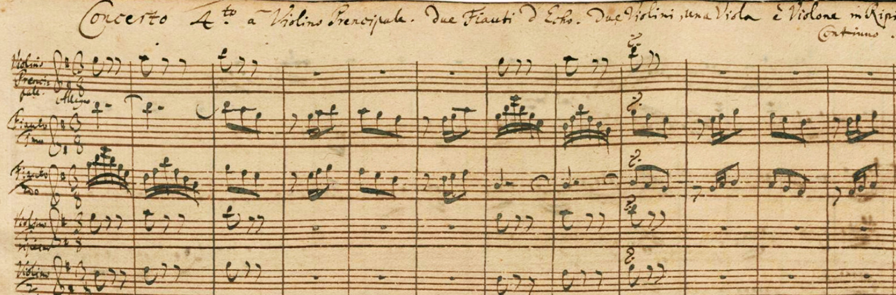
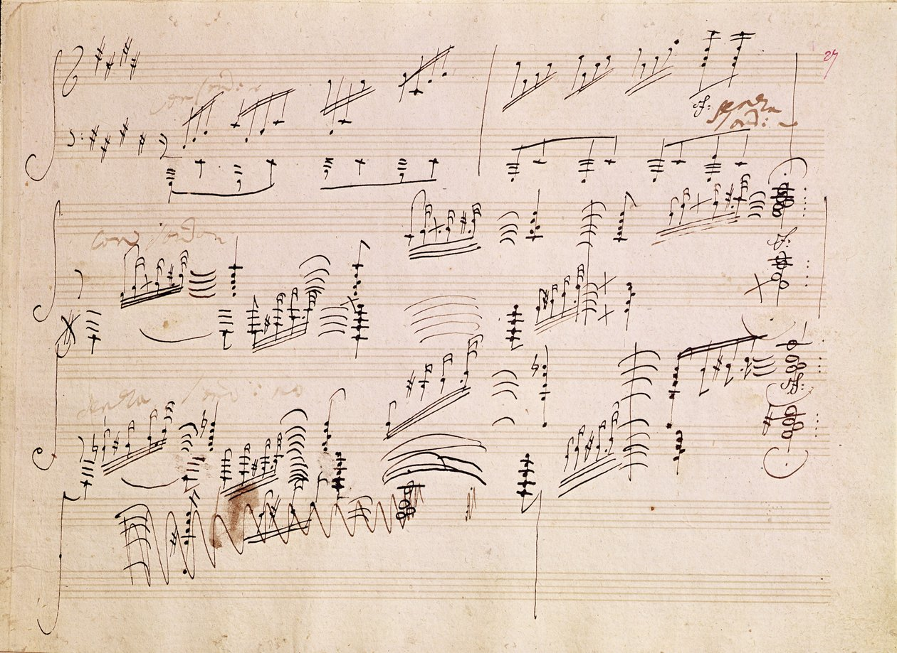

# sesion-13b

## Clase 

### Evolución partituras

En la clase hicimos un pequeño recorrido a través de la historia de la representación conceptual de la música

1. Cantos gregorianos

 

2. Johann Sebastian Bach

  

3. Ludwig van Beethoven

 

Como se puede ver, cada vez se buscaba generar más detalle y control sobre el como debía sonar cada partitura

Esto puede servir para el proyecto en 2 sentidos

1. Generar una partitura que controle cada posible sonido

2. Generar una partitura que potencie el libre albedrío

En lo personal, según lo que he podido reflexionar con Grapefruit de Yoko Ono, mientras menos indicaciones y por ende más libertad se le deja a la persona, más posibles resultados y esto es algo mágico, no siempre se logra el mismo sonido, como nosotros no somos siempre la misma persona (spoiler de abajo? 👁️)

---

### Yoko Ono - Grapefruit

#### Capitulo 3 / Evento

Algo relevante que se dio en este capítulo, fue la mención de _**Weltinnenraum**_. Estuve buscando información y parece ser un concepto del poeta Rainer Maria Rilke que se enfoca en el espacio interior del mundo.

_**Pieza de nombre**_ fue una que me recordó mi situación actual, solo que con el _alias_, _nombre de usuario_ o _nickname_. Ya que busco la manera de profesionalizar mis cuentas con mi portafolio y no encuentro un nombre que convenza. Fuera de eso, puedo entender que esta pieza hace mención a como nuestra identidad va cambiando y variando en base al diario vivir y como nuestro nombre se asocia a estas identidad, por ejemplo la Camila Ramírez de 14 años no es la misma que la Camila Ramírez del dia 21 de Junio del 2026 ¿Podemos decir que sigo siendo Camila? Esto se enlaza con la paradoja de Teseo, donde se va reparando un barco a medida que se navega, llegará un momento donde cada tabla del barco haya sido reemplazada y surgue la pregunta ¿Es el mismo barco?¿Que define que asi lo sea? Puede que este solo sobrepensando nuevamente, pero creo que este libro me invita a reflexionar más de lo que creí que lo haría

#### Capitulo 4 / Poesia

En este capítulo me costó identificar algo que haga diferente este a otro, un punto que podría considerar como característico es el uso de un recurso _"externo"_, puesto que desde _**poema tactil V**_ o **_Cuesionario_** se utiliza una ficha o un listado que rellenar, tal como funcionaria un libro de clases. La verdad este capítulo fue el que menos me gusto, no llegue a una reflexión como en otros capítulos. Sin duda deberé releerlo en otro momento, tal vez el estar enferma y cansada me dificultó generar una reflexión

 

### Comunicación grupal

#### Sintetizador

En esta clase nos dedicamos a coordinar aspectos a tomar en cuenta del sintetizador, considerando que queriamos experimentar y dar tiempo a probar configuraciones diferentes optamos por la siguiente idea:

- Soldar todas las placas

- Usar una carcasa donde puedan caer todas las placas

  La idea de esto es optimizar tiempos, de testeo, asi que debemos ser agiles en la construcción

#### Ideas

Además de que definimos que el sonido no se iba a poder manipular de mnaera directa por el usuario, sino que respondería a estimulos del entorno, de momento solo pensamos en LDR

[Nota]

Revisando los esquemáticos nos dimos cuenta que los 4 VCO que se fabricaron no se consideró conectar un input, por lo que nuestro secuenciador queda fuera :(((

> Recordar que fabricamos 2 secuenciadores, obviamente vamos a querer usarlos xd

## Post - Clase

Hablando con Vania me menciono algo IMPORTANTE, no todo tiene que sonar junto. Esto signfica que podemos tener sonidos funcionando en paralelo.

Un ejemplo podría ser:

1. Piezo > Secuenciador > Percusión > Filtro

2. VCO > Filtro

3. VCO > Percusión > Filtro

   Todo esto sonando a la vez

 

### Ideas

Idea loca que se nos ocurrio, que haya una planta creciendo en el sintetizador.

Ya que queremos que esto reaccione al entorno, queremos replicar lo que hace una planta en teoría
